# Features

End-to-end walkthroughs for every feature in Expensly — what it does, how it works under the hood, and which components are involved.

---

## Table of Contents

1. [Organization Registration & Approval](#organization-registration--approval)
2. [Two-Factor Authentication (OTP Login)](#two-factor-authentication-otp-login)
3. [Password Reset](#password-reset)
4. [Expense Submission](#expense-submission)
5. [Expense Approval Workflow](#expense-approval-workflow)
6. [Multi-Currency Support & Exchange Rates](#multi-currency-support--exchange-rates)
7. [Department Budget Tracking](#department-budget-tracking)
8. [Automatic Budget Resets (Cron)](#automatic-budget-resets-cron)
9. [Receipt Uploads (AWS S3)](#receipt-uploads-aws-s3)
10. [CSV Report Generation & Email](#csv-report-generation--email)
11. [Analytics](#analytics)
12. [Real-Time Updates (Socket.IO)](#real-time-updates-socketio)
13. [Role-Based Access Control](#role-based-access-control)
14. [Super Admin Platform Management](#super-admin-platform-management)

---

## Organization Registration & Approval

### What it does

A company signs up for Expensly. Their org and admin account start in a disabled state until a platform super admin manually approves the registration.

### Flow

```
1. Company fills in: org name, slug, admin name, email, password
   POST /api/auth/signup

2. Backend creates:
   · Organization document (isDisabled: true)
   · User document — role: admin, isDisabled: true

3. Super admin logs in and views pending orgs
   GET /api/superadmin/organizations?disabled=true

4. Super admin approves
   PATCH /api/superadmin/organizations/:id/disable  (toggles to false)
   PATCH /api/superadmin/users/:id/disable          (toggles admin user to false)

5. An approval/rejection email is sent to the admin's email address

6. Now the org admin can log in and begin setting up:
   · Create departments
   · Invite users
   · Set exchange rates
   · Configure budgets
```

**Files involved:** `auth.controller.ts`, `superadmin.controller.ts`, `Organization.model.ts`, `User.model.ts`, `email.service.ts`

---

## Two-Factor Authentication (OTP Login)

### What it does

All users authenticate with a two-step process: password check first, then a time-limited email OTP.

### Flow

```
Step 1 — Password
  POST /api/auth/login  { email, password }
  · Backend validates credentials via bcrypt compare
  · Generates 6-digit OTP via crypto.randomInt
  · Stores OTP in Redis: key = otp:<userId>, TTL = OTP_EXPIRES_IN (default 300 s)
  · Sends "Login OTP" email to user
  · Returns: { userId } — no token yet

Step 2 — OTP
  POST /api/auth/verify-otp  { userId, otp }
  · Fetches OTP from Redis
  · If max attempts exceeded (5): throws 429 Too Many Requests
  · Compares OTP strings
  · On success:
      · Deletes Redis key
      · Issues JWT access token (15 min, returned in response body)
      · Issues opaque refresh token (7 days, stored as SHA-256 hash in DB)
      · Sets refresh token in HttpOnly SameSite=Strict cookie
      · Returns: { accessToken, user }
```

| Light | Dark |
|---|---|
| 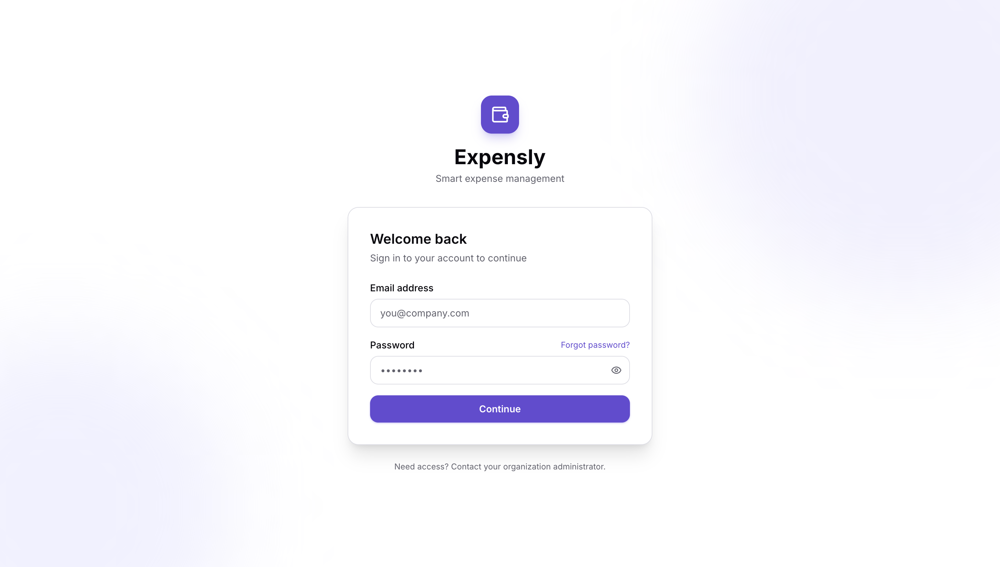 | 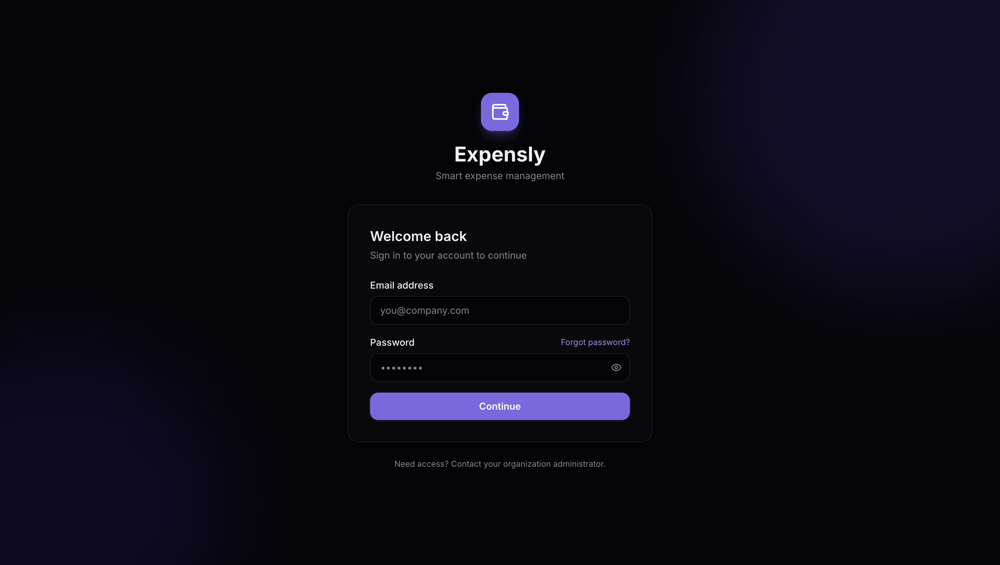 |

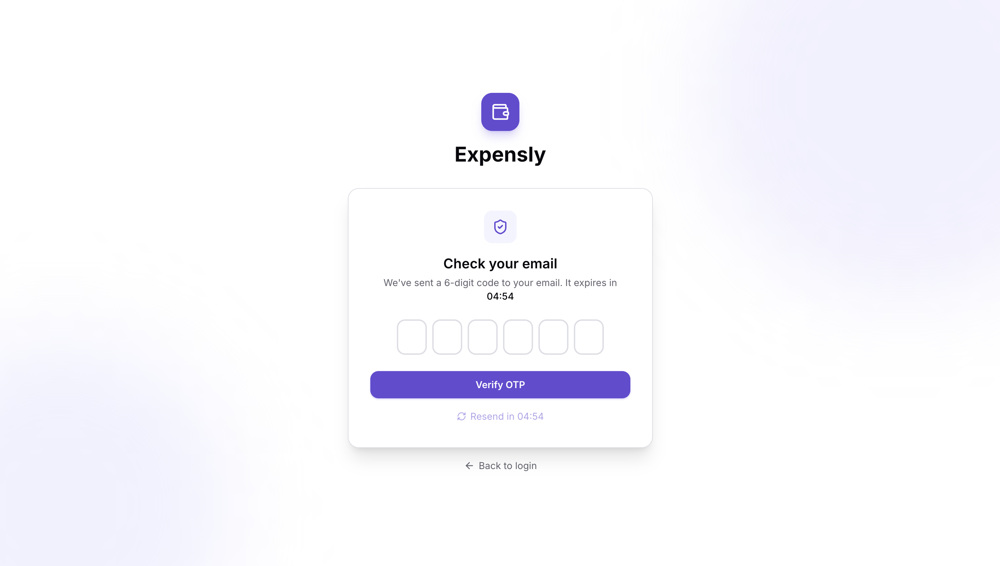

**Security properties:**
- OTP is 6 digits and expires in 5 minutes.
- After 5 failed attempts the OTP is invalidated and a new one must be requested.
- Access tokens are short-lived (15 min) to limit blast radius of token theft.
- Refresh tokens in HttpOnly cookies cannot be read by JavaScript — protected from XSS.
- Refresh token rotation: each `/auth/refresh` call creates a new token and revokes the old one.

**Files involved:** `auth.controller.ts`, `auth.service.ts`, `cache.service.ts`, `email.service.ts`, `RefreshToken.model.ts`

---

## Password Reset

### Flow

```
POST /api/auth/forgot-password  { email }
  · Generates a password-reset OTP
  · Stores in Redis: key = pwd:<userId>, TTL = OTP_EXPIRES_IN
  · Sends "Password Reset" email
  · Returns: { userId }

POST /api/auth/reset-password  { userId, otp, newPassword }
  · Fetches and validates OTP from Redis
  · Hashes new password with bcrypt
  · Updates user.passwordHash
  · Revokes all existing refresh tokens (revokeAllUserTokens)
  · Returns success
```

**Files involved:** `auth.controller.ts`, `auth.service.ts`, `cache.service.ts`, `email.service.ts`

---

## Expense Submission

### What it does

Employees submit expense reimbursement requests with optional receipt attachments.

### Flow

```
POST /api/users/expenses  (multipart/form-data)

1. Multer middleware intercepts the request.
   If a receipt file is present:
   · Validates file type (image/*) and size (max 5 MB)
   · Streams directly to S3 via custom multer-s3 storage engine
   · Key: expensly/<orgSlug>/<newObjectId>.<ext>

2. Controller reads validated body fields.

3. Determines approval requirement:
   · Does the submitter have a managerId?
   · Is amount >= dept.approvalThresholds[currency]?
   · YES → status = 'pending',          managerApproval.required = true
   · NO  → status = 'awaiting_finance', managerApproval = null

4. Creates Ticket document with submitterManagerId snapshot.

5. Emits 'new_ticket' Socket.IO event to dept:<deptId> room.

6. Sends 'Ticket Submitted' confirmation email to submitter.

7. Returns 201 with ticket object.
```

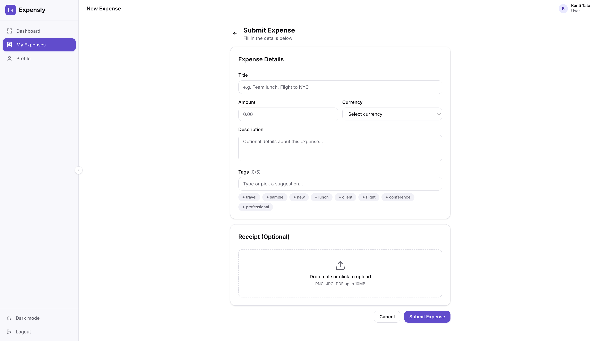

**Files involved:** `ticket.controller.ts`, `Ticket.model.ts`, `s3.service.ts`, `email.service.ts`, `middleware/upload.ts`

---

## Expense Approval Workflow

### Overview

Tickets move through a configurable approval chain: optionally a manager first, then finance. See [data-models.md — Approval State Machine](./data-models.md#approval-state-machine) for the full state diagram.

### Manager Approval

```
PATCH /api/users/expenses/:id/status  { approved: true|false, comments? }

· Authenticated user must have canApprove permission
· For manager step: user must be the submitter's submitterManagerId
· Transition:
    approved=true  → status = 'awaiting_finance'
    approved=false → status = 'rejected'
· managerApproval.approved, reviewedBy, reviewedAt, comments are set
· Emits 'ticket_status_change' to org:<orgId>
· Invalidates analytics Redis cache
· Sends status-change email to submitter
```


### Finance Approval

```
· Same endpoint, same permission check (canApprove)
· For finance step: any user with canApprove in the department
· Transition:
    approved=true  → status = 'approved'
                     ticket.exchangeRateSnapshotId = org.currentRateSnapshotId  (LOCKED)
                     dept.spent += convertAmount(amount, currency, baseCurrency, rates)
    approved=false → status = 'rejected'
· financeApproval fields populated
· Emits 'ticket_status_change'
· Invalidates analytics cache
· Sends status-change email to submitter
```

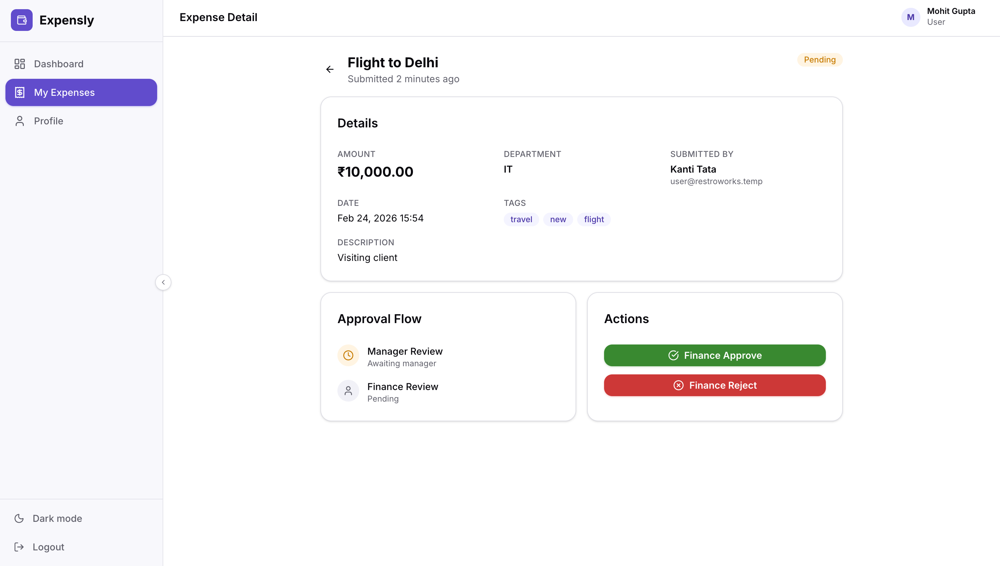

### Flagging

Any user with `canApprove` can toggle `flagged` on any ticket:
```
PATCH /api/users/expenses/:id/flag
· Toggles ticket.flagged boolean
· Emits 'ticket_flag' to dept:<deptId>
```

**Files involved:** `ticket.controller.ts`, `Ticket.model.ts`, `Department.model.ts`, `analytics.service.ts`, `email.service.ts`

---

## Multi-Currency Support & Exchange Rates

### Overview

Organizations set a `baseCurrency`. Employees submit expenses in any of the org's `activeCurrencies`. Approved amounts are always converted to `baseCurrency` for analytics and budget tracking using the exchange rates at the time of approval.

### Rate Management

```
Source 1 — External fetch (open.er-api.com, free, no API key):
  POST /api/admin/exchange-rates/fetch-latest
  · Calls fetchExternalRates(baseCurrency)
  · Caches raw API response in Redis for 1 h
  · Creates new ExchangeRateSnapshot (source: 'fetched')
  · Sets org.currentRateSnapshotId

Source 2 — Manual entry:
  PATCH /api/admin/exchange-rates
  · Admin supplies { rates: { EUR: 0.90, ... } }
  · Creates new ExchangeRateSnapshot (source: 'manual')
  · Sets org.currentRateSnapshotId

Preview (no save):
  GET /api/admin/exchange-rates/fetch-preview
  · Returns what the external rates look like right now
```

### Rate Locking

When a ticket is **approved** by finance:
- `ticket.exchangeRateSnapshotId` is set to `org.currentRateSnapshotId`.
- All future analytics calculations for this ticket use those locked historical rates.
- This ensures that historical reports remain consistent even if rates are updated later.

### Conversion formula

```
convertAmount(amount, fromCurrency, toCurrency, rates):
  amountInBase = amount / rates[fromCurrency]   // or amount if from === base
  result       = amountInBase * rates[toCurrency]  // or amountInBase if to === base
```

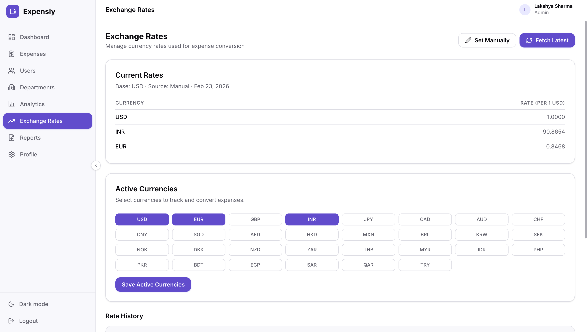

**Files involved:** `exchangeRates.controller.ts`, `exchangeRates.service.ts`, `ExchangeRateSnapshot.model.ts`, `cache.service.ts`

---

## Department Budget Tracking

### Overview

Each department has a `budget` (base currency). As tickets are approved, `spent` increments. Admins see `budgetUsagePercent` in analytics.

### Update on approval

```
Ticket approved (finance) →
  org.currentRateSnapshotId fetched
  converted = convertAmount(ticket.amount, ticket.currency, org.baseCurrency, snapshot.rates)
  dept.spent += converted
  dept.save()
```

### Manual reset

```
POST /api/admin/departments/:id/reset-budget
  dept.spent = 0
  dept.nextResetDate = calculateNextResetDate(dept.budgetResetPeriod)
  dept.save()
```

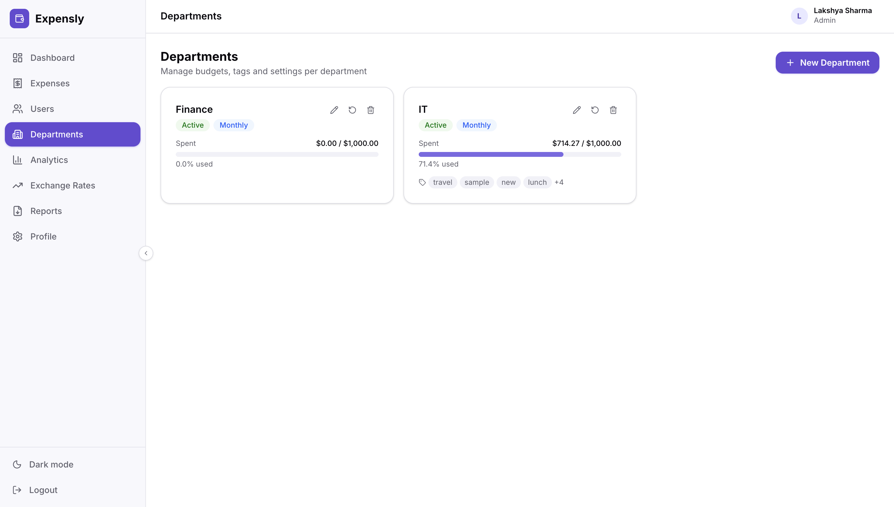

**Files involved:** `department.controller.ts`, `Department.model.ts`, `budget.service.ts`

---

## Automatic Budget Resets (Cron)

### Schedule

Every hour at `:00` (e.g. 09:00, 10:00, 11:00…):

```
processDueBudgetResets():
  1. Query: Department.find({ nextResetDate: { $lte: now }, isActive: true })
  2. For each department:
       dept.spent = 0
       dept.nextResetDate = calculateNextResetDate(dept.budgetResetPeriod, now)
       dept.save()
```

### Reset periods

| Period | `nextResetDate` calculation |
|---|---|
| `monthly` | First day of the next calendar month at midnight |
| `quarterly` | First day of the next quarter at midnight |
| `yearly` | January 1st of the next year at midnight |
| `none` | `null` — never auto-reset |

**Files involved:** `cron.ts`, `budget.service.ts`, `Department.model.ts`

---

## Receipt Uploads (AWS S3)

### Flow

```
1. Employee attaches receipt to POST /api/users/expenses
2. Multer-S3 storage engine streams the file to S3 (never lands on disk):
     Key:    expensly/<orgSlug>/<ticketId>.<ext>
     ACL:    private (no public access)
     Bucket: AWS_BUCKET env variable
3. ticket.receiptKey = '<key>' is stored in MongoDB

4. When viewing a ticket:
   GET /api/users/expenses/:id/receipt
   → s3.getReceiptSignedUrl(receiptKey)
   → Pre-signed URL valid for 1 hour
   → Client opens the URL to view/download
```

**Supported formats:** `image/jpeg`, `image/png`, `image/webp`, `application/pdf` (up to 5 MB)

**Files involved:** `ticket.controller.ts`, `s3.service.ts`, `middleware/upload.ts`

---

## CSV Report Generation & Email

### Generation flow

```
GET /api/users/reports/export?status=approved&from=2025-01-01&to=2025-03-31

1. Query tickets matching filters and user's scope
2. csv.service.generateTicketsCsv(tickets)
   · Uses csv-stringify with headers
   · Prepends UTF-8 BOM for Excel compatibility
   · Columns: Title, Description, Tags, Amount, Currency, Submitted By,
              Department, Date Submitted, Status, Flagged, Manager Review,
              Manager Reviewed By, Manager Comments, Finance Review,
              Finance Reviewed By, Finance Comments
3. s3.uploadFile(csvBuffer, reportKey, 'text/csv')
   · Key: expensly/<orgSlug>/reports/<reportId>.csv
4. Create Report document in MongoDB
5. If user now has > 5 reports: delete oldest (S3 + DB)
6. Return pre-signed download URL (1 h expiry) + report metadata
```

### Email flow

```
POST /api/users/reports/:id/email

1. Fetch report metadata from DB
2. s3.getReportBuffer(s3Key) — download CSV into memory
3. email.service sends HTML email with CSV as attachment to req.user.email
```

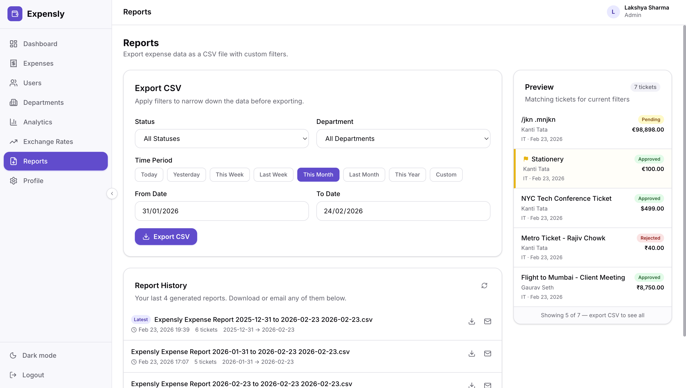

**Files involved:** `reports.controller.ts`, `csv.service.ts`, `s3.service.ts`, `email.service.ts`, `Report.model.ts`

---

## Analytics

### Overview

Org-wide analytics are stored in a single `OrgAnalytics` document per organization and cached in Redis for 1 hour. They include org-level aggregates and per-department breakdowns.

### Refresh triggers

| Trigger | When |
|---|---|
| Daily cron (midnight) | All orgs refreshed in parallel via `Promise.allSettled` |
| Ticket approved / rejected | Cache invalidated; recomputed on next read |
| `POST /api/admin/analytics/refresh` | Manual admin trigger |

### Computation

```
refreshOrgAnalytics(orgId):
  1. Aggregate Ticket collection by orgId
  2. For approved tickets: convert all amounts to baseCurrency using
     ticket.exchangeRateSnapshotId.rates (locked historical rates)
  3. Compute per-dept breakdowns (budget usage, avg resolution, top tags)
  4. Upsert OrgAnalytics document
  5. Store in Redis: key = analytics:<orgId>, TTL = 3600 s
```

### Frontend charts

Recharts renders these views from the `/api/admin/analytics` response:
- **Status breakdown** (bar chart) — pending / awaiting_finance / approved / rejected counts
- **Monthly spend** (area chart) — approved amounts over time
- **Department budget usage** (horizontal bar) — spent vs budget per dept
- **Currency split** (pie chart) — approved amounts by currency
- **Top tags** (list/badge cloud)

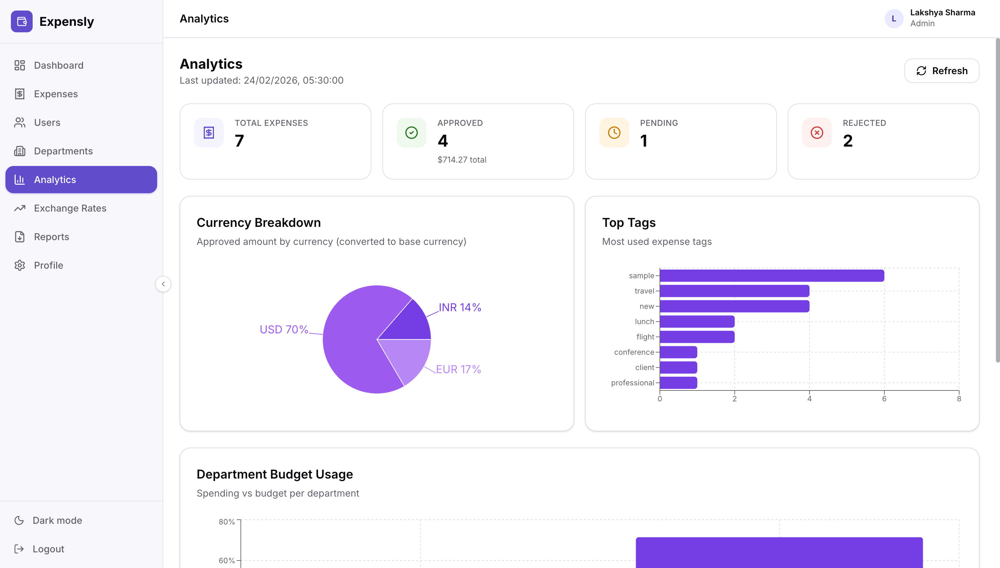

**Files involved:** `analytics.controller.ts`, `analytics.service.ts`, `OrgAnalytics.model.ts`, `cache.service.ts`

---

## Real-Time Updates (Socket.IO)

### Overview

After authentication, the frontend maintains a persistent WebSocket connection. All state-mutating API calls on the backend emit typed Socket.IO events to the relevant rooms. The frontend updates its UI reactively without polling.

### Frontend integration pattern

```typescript
// In a React component or hook:
useEffect(() => {
  const handler = (payload: TicketStatusChangePayload) => {
    // update local state / trigger re-fetch
  };
  socketClient.on('ticket_status_change', handler);
  return () => socketClient.off('ticket_status_change', handler);
}, []);
```

See [websockets.md](./websockets.md) for the full event catalogue.

---

## Role-Based Access Control

### Three roles

| Role | Scope | Typical user |
|---|---|---|
| `user` | Own tickets, own reports, own departments list | Employee submitting expenses |
| `admin` | Org-wide: all users, departments, budgets, exchange rates, analytics | Finance manager / HR admin |
| `super_admin` | Platform-wide: all organizations and their users | Platform owner / SaaS operator |

### Fine-grained permission overrides

Within the `user` and `admin` roles, two boolean permissions can be overridden per-user (or set as dept defaults):

| Permission | Effect |
|---|---|
| `canViewAllTickets` | See all tickets in the org (not just own). Used for finance reviewers. |
| `canApprove` | Approve / reject tickets (manager or finance). Required for any approval action. |

### Enforcement layers

| Layer | Implementation |
|---|---|
| Route-level | `authorize('admin')` middleware rejects mismatched roles |
| Controller-level | Explicit `canApprove` + ownership checks before status mutations |
| Frontend | `PrivateRoute` redirects users away from routes their role cannot access |

---

## Super Admin Platform Management

### Organizations panel

- View all organizations (searchable, filterable by disabled state).
- Create new organizations manually.
- Enable or disable an entire organization — disabling immediately blocks all logins for that org's users.
- Update org metadata (name, slug, base currency, active currencies).

| Light | Dark |
|---|---|
| 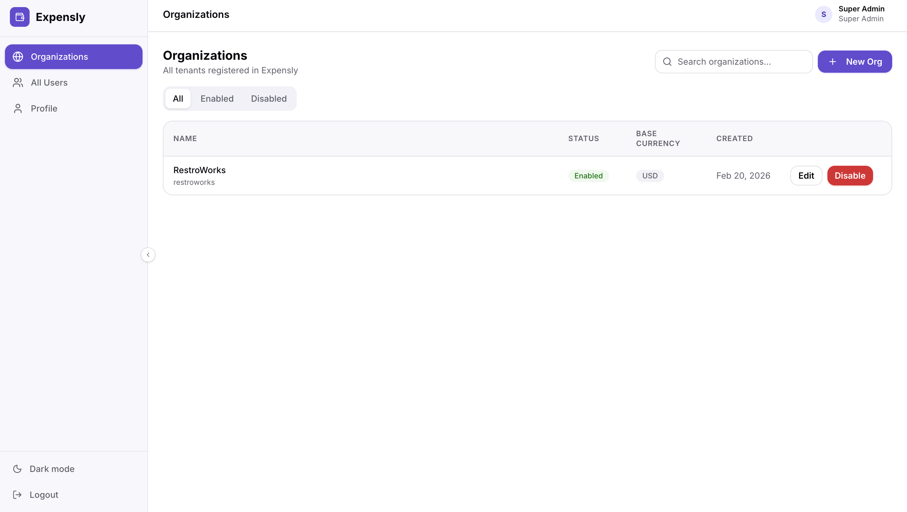 | 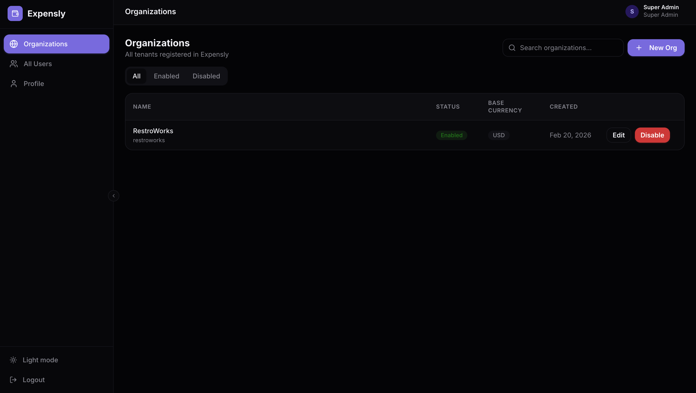 |

### Users panel

- View all users across every org in a single paginated table.
- Create users in any org.
- Enable / disable individual users.
- Update user details.

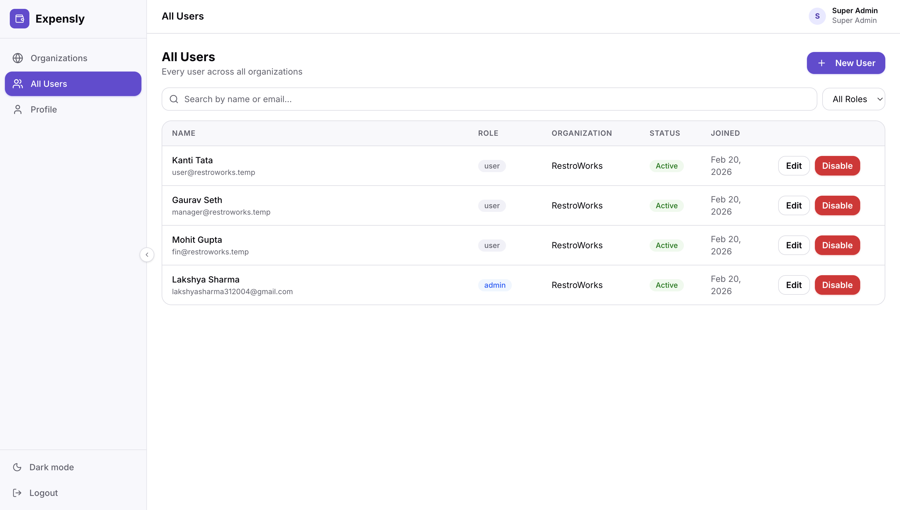

### First boot seeding

On application startup, `seedSuperAdmin()` checks whether a user with `SUPER_ADMIN_EMAIL` exists. If not, it creates one with `role: super_admin` and hashes the `SUPER_ADMIN_PASSWORD`. This runs exactly once — subsequent boots skip the seed if the email is already present.

**Files involved:** `superadmin.controller.ts`, `utils/superadmin.ts`, `Organization.model.ts`, `User.model.ts`
